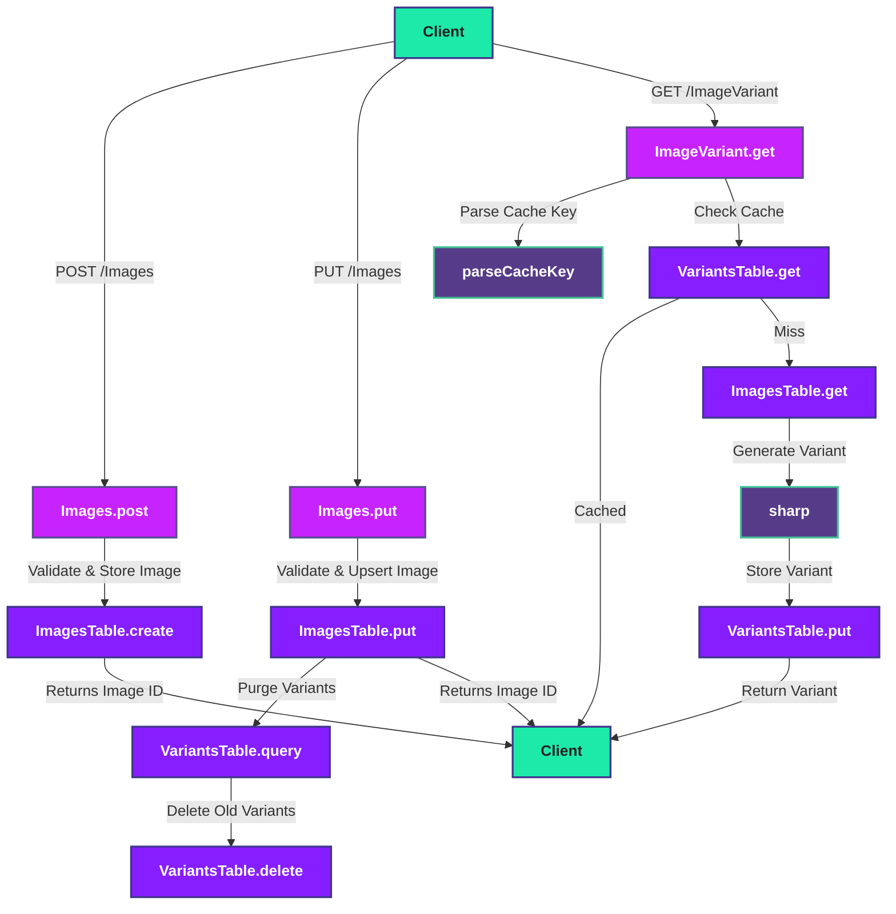

# Image Optimizer

This application provides a REST API for uploading and retrieving optimized images using Harper as the backend. Images are stored as Blobs in their original format and can be dynamically resized and converted to modern formats (WebP, AVIF, JPEG) for efficient delivery to any device. It supports automatic variant caching, so once an image variant (by size, DPR, and format) is generated, it is stored in the `image_variants` table and reused for subsequent requests.

A website can use this API to improve performance and user experience:

- **Serve optimal formats**: Automatically delivers images in the best format for each browser/device.
- **Responsive images**: Dynamically resizes images to match the exact dimensions needed for any screen, reducing bandwidth and load times.
- **Variant caching**: Caches and reuses optimized variants, so images are processed only once per size/format.
- **Better Core Web Vitals**: Reduces page weight and speeds up rendering, especially for mobile and slow connections.

## How it works

When an image is uploaded through `/Images`, it is validated with Sharp and then stored in the images table in its original form as a Blob using Harper’s createBlob method. This ensures that binary data is handled efficiently and can be retrieved in a consistent format across environments.

Clients request optimized versions through `/ImageVariant/${cacheKey}`, where the cache key encodes the original image ID, requested width (or orig), device pixel ratio (DPR), and output format (e.g. WebP, AVIF, JPEG, PNG).

On each request:

- The API first checks the `image_variants` table to see if the requested variant already exists. If found, it is returned instantly.
- If the variant is missing, Sharp generates the resized/reformatted image, and the API stores it back into the image_variants table using createBlob.
- Variants are automatically reused for future requests with the same cache key.
- When an original image is replaced in `/Images`, all of its associated cached variants are purged so they can be regenerated on demand.



## Database Structure and Table Overview

- **Database**: `ImageOptimization`
- **Tables**:
  - `images`: stores original uploaded images as Blobs, along with metadata such as content type and timestamps.
  - `image_variants`: acts as a cache for optimized variants, storing resized and reformatted versions for fast retrieval. Each record is keyed by a cache key `(imageId_width_dpr_format)`
- See `schema.graphql` for table definitions.
- See `config.yaml` for API and resource setup.

## File Overview

- `api/resources.ts`: Main API logic for image upload, optimization, retrieval, and upsert (PUT). Handles binary data as Blobs for database storage.
- `schema.graphql`: Database schema for images and variants.
- `config.yaml`: Application configuration.

## Getting Started

```
git clone https://github.com/HarperDB/image-optimizer.git

cd image-optimizer

npm run dev
```

This assumes you have the Harper stack already [installed](https://docs.harperdb.io/docs/deployments/install-harper) globally.

> **Note:** Ensure Harper `component` is running with databases and tables created for `resources.ts`. You can do this using the operations API (http://localhost:9925). 

Create the database:
```json
{
	"operation": "create_database",
	"database": "ImageOptimization"
}
```

Create the tables:
```json
{
	"operation": "create_table",
	"database": "ImageOptimization",
	"table": "images",
	"primary_key": "id"
}
```
```json
{
	"operation": "create_table",
	"database": "ImageOptimization",
	"table": "image_variants",
	"primary_key": "id"
}
```

## Endpoints

### Retrieve a cached or on-demand variant image (GET)

Use any HTTP client to fetch an optimized image variant. Requests go through /ImageVariant and use a cache key:

```bash
${imageId}_${width|orig}_${dpr}_${format}
```

```sh
curl -u username:password \
  "http://localhost:9926/ImageVariant/abc123_400_2_webp" \
```

Or in Postman:

- Set method to GET
- Set URL to `http://localhost:9926/ImageVariant?id=abc123_400_2_webp`
- In Authorization tab, select "Basic Auth" and enter your HarperDB username and password

### Upload an image (POST)

Use curl or Postman to upload an image (with Basic Auth). The image will be stored as a Blob:

```sh
curl --data-binary @your-image.png \
	-H "Content-Type: image/png" \
	-u username:password \
	http://localhost:9926/Images
```

Or in Postman:

- Set method to POST
- Set URL to `http://localhost:9926/Images`
- In Body, select `binary` and choose your image file
- Set header `Content-Type: image/png` (or your image type)
- In Authorization tab, select "Basic Auth" and enter your HarperDB username and password

### Upload or update an image with a specific ID (PUT)

Use curl or Postman to upload or update an image and specify the image ID:

```sh
curl --request PUT --data-binary @your-image.png \
	-H "Content-Type: image/png" \
	-u username:password \
	http://localhost:9926/Images?id=IMAGE_ID
```

Or in Postman:

- Set method to PUT
- Set URL to `http://localhost:9926/Images?id=IMAGE_ID`
- In Body, select `binary` and choose your image file
- Set header `Content-Type: image/png` (or your image type)
- In Authorization tab, select "Basic Auth" and enter your HarperDB username and password

## Testing

This application uses Node.js' built-in test runner for integration tests. The tests interact with a running Harper instance and the API endpoints, simulating real-world usage. Key flows covered include image upload, variant generation and caching, image updates, and error handling.

- **Test Environment Setup:**
  - Harper is started and configured before tests run (see `.github/workflows/test.yaml` for CI setup).
  - The required database (`ImageOptimization`) and tables (`images`, `image_variants`) are created automatically using the HarperDB operations API.
  - A valid test image is placed in the test directory and used for upload scenarios.

- **Test Execution:**
  - Tests use real HTTP requests to interact with the API endpoints (`/Images`, `/ImageVariant`).
  - Each test checks for correct status codes, response bodies, and expected side effects (e.g., caching, purging variants).
  - Error scenarios (invalid uploads, missing data, malformed requests) are also covered to ensure robust handling.

- **Running Tests Locally:**
  - Make sure Harper is running and the database/tables are set up.
  - Run `npm test` to execute the test suite.

- **Running Tests in CI:**
  - The GitHub Actions workflow (`.github/workflows/test.yaml`) automates HarperDB setup, database/table creation, and test execution.
  - Logs are uploaded for debugging if any tests fail.

  > **Note:** Integration tests require a valid image file named test-image.png in the test directory. Make sure this file exists and is a real image (not empty or corrupted) before running tests locally or in CI.
